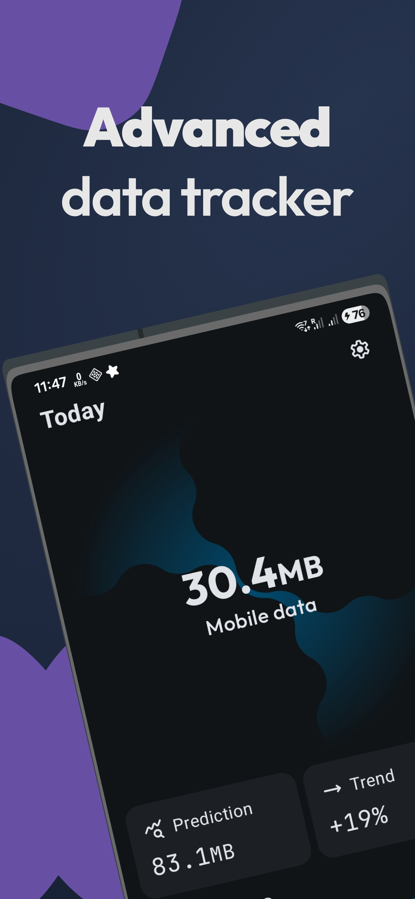
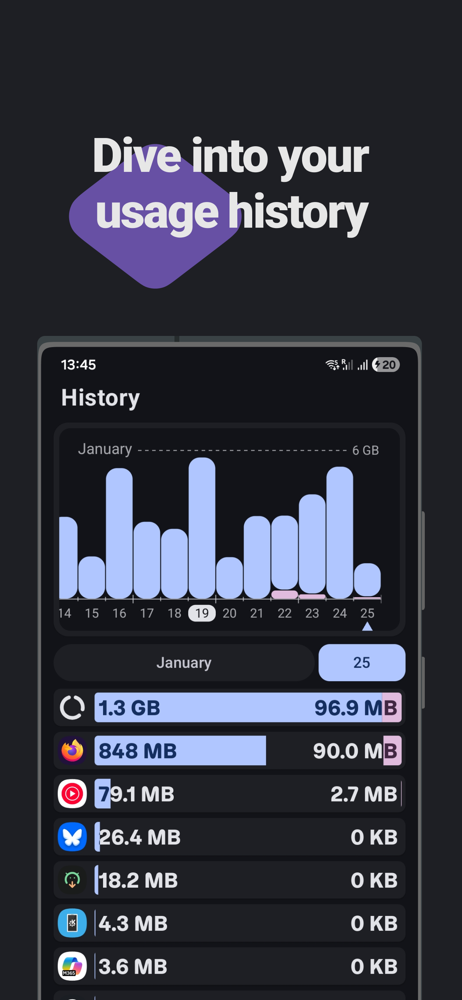
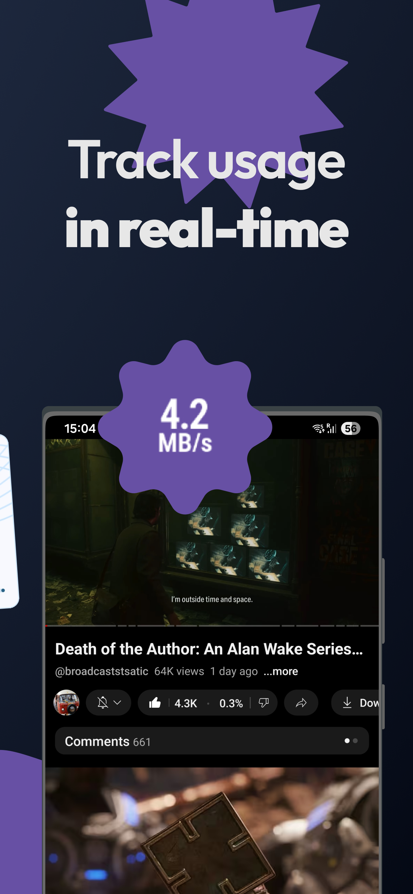
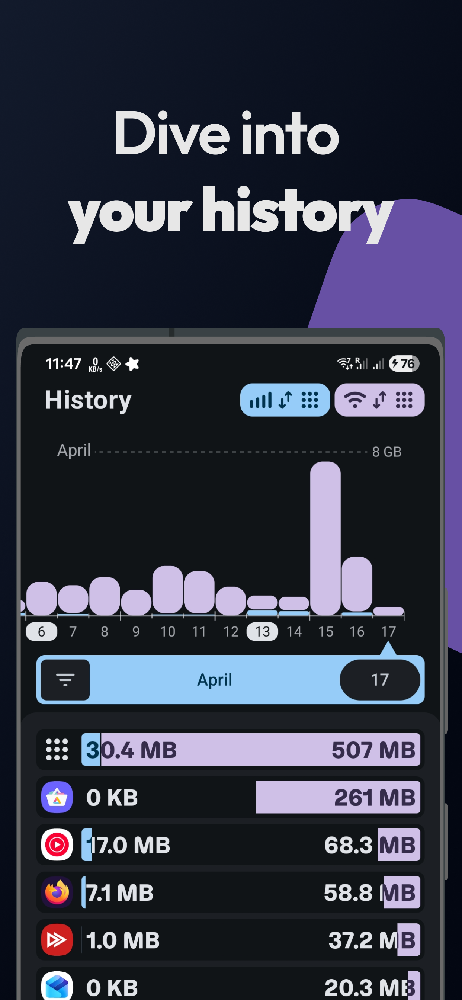

# Traffic Light
Traffic Light is an open-source tool for tracking your network usage while ensuring total privacy. Inspired by Internet Speed Meter and GlassWire.

## Why?
- Free and open source
- Uses [fewer permissions](https://github.com/leekleak/traffic-light/wiki/Permissions)
- Uses [less battery](https://github.com/leekleak/traffic-light/wiki/Battery-Usage)
- No tracking
- Beautiful UI
- Fast and modern

## Downloads

|  |  |  |
|-------------------------------------------------------------------------------------------------------------------------------------------------------|--------------------------------------------------------------------------------------------------------------------------------|--------------------------------------------------------------------------------------------------------------------------------|

## Screenshots

|  |  |  |  |
|-------------------------------------------------------------------------------------------|-------------------------------------------------------------------------------------------|-------------------------------------------------------------------------------------------|-------------------------------------------------------------------------------------------|

## Feedback

Make sure to follow the __issue template__ when reporting bugs or suggesting features! Reports not following the general outline will be closed without further consideration.

## Contributions

### Code
Contributors are welcome, however please create an issue first. When asking/adding features please elaborate why that feature is useful to you.

### Translations

Translation can be done on [Weblate](https://hosted.weblate.org/engage/traffic-light/)

## Troubleshooting
Check out the troubleshooting wiki [page](https://github.com/leekleak/traffic-light/wiki/Troubleshooting).
