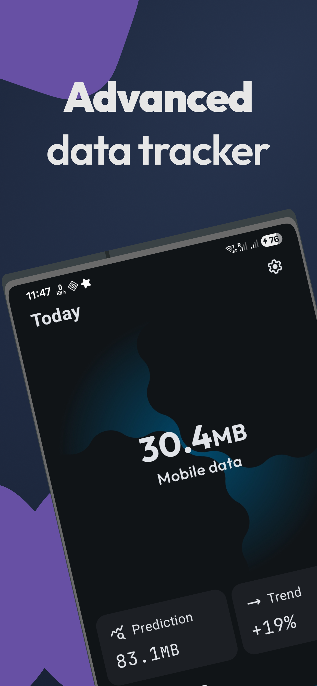
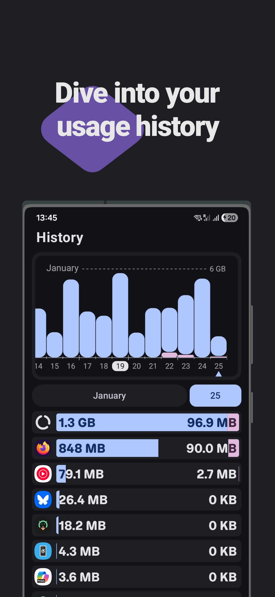
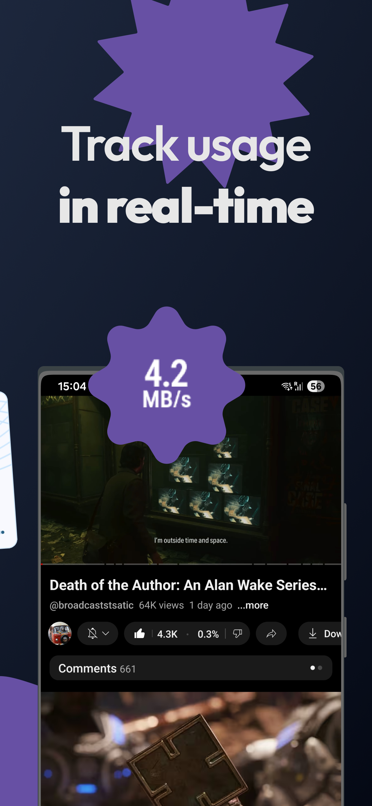
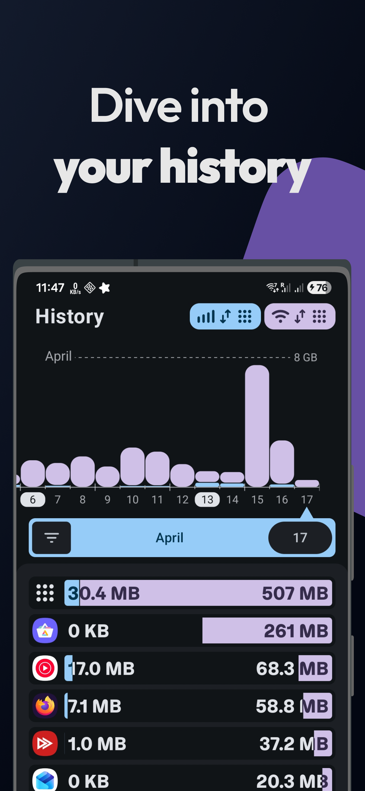

# Traffic Light
Traffic Light is an open-source tool for tracking your network usage while ensuring total privacy. Inspired by Internet Speed Meter and GlassWire.

## Features
- Data plan tracking (including multiple SIMs)
- Beautiful widgets
- Status bar network indicator
- In-depth historical data tracking
- At a glance usage analytics
- Uses [less battery](https://github.com/leekleak/traffic-light/wiki/Battery-Usage) than alternatives
- Fast and modern with a stunning design

## Downloads

| Method |  |  |  |
|--------|-------------------------------------------------------------------------------------------------------------------------------------------------------|--------------------------------------------------------------------------------------------------------------------------------|--------------------------------------------------------------------------------------------------------------------------------|
| Delay | No delay | Delay depends on F-Droid maintainers | Delay until stable release |

## Screenshots

  
  
  
  

## Feedback

Make sure to follow the __issue template__ when reporting bugs or suggesting features! Reports not following the general outline will be closed without further consideration.

## Contributions

### Code
Contributors are welcome, however please create an issue first. When asking/adding features please elaborate why that feature is useful to you.

### Translations

Translation can be done on [Weblate](https://hosted.weblate.org/engage/traffic-light/)

## FAQ
Check out the [wiki](https://github.com/leekleak/traffic-light/wiki) as the info you're looking may be there.
Popular pages:
- [Troubleshooting](https://github.com/leekleak/traffic-light/wiki/Troubleshooting)
- [Setting up Shizuku for multi-SIM tracking](https://github.com/leekleak/traffic-light/wiki/Setting-up-Shizuku-for-multi%E2%80%90SIM-tracking)
- [Hiding status bar icon when disconnected](https://github.com/leekleak/traffic-light/wiki/Hide-status-bar-icon-when-disconnected)

